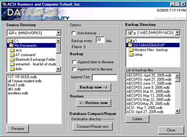



## Database Automatic Backup

### Description

This program can automatically backup your database in the specified time interval on the specific location, database filename will be appended with time and date to avoid overwriting of previously backed up file, and also give the user and information when was the backup file was created, I used this program in our system to backup its database every 4 hours to avoid data lost if ever there are data corruption because of brownouts or network failure.
 
### More Info
 
optionall text to append after database filename or time and date after the filename during backing up

knowledge in database file specially Ms Access file (*.mdb)

             |
---                |---
**Submitted On**   |2004-02-04 04:06:58
**By**             |[Dario Mindoro](https://github.com/Planet-Source-Code/PSCIndex/blob/master/ByAuthor/dario-mindoro.md)
**Level**          |Advanced
**User Rating**    |4.9 (39 globes from 8 users)
**Compatibility**  |VB 6\.0
**Category**       |[Databases/ Data Access/ DAO/ ADO](https://github.com/Planet-Source-Code/PSCIndex/blob/master/ByCategory/databases-data-access-dao-ado__1-6.md)
**World**          |[Visual Basic](https://github.com/Planet-Source-Code/PSCIndex/blob/master/ByWorld/visual-basic.md)
**Archive File**   |[Database\_A1906256282005\.zip](https://github.com/Planet-Source-Code/dario-mindoro-database-automatic-backup__1-61371/archive/master.zip)

